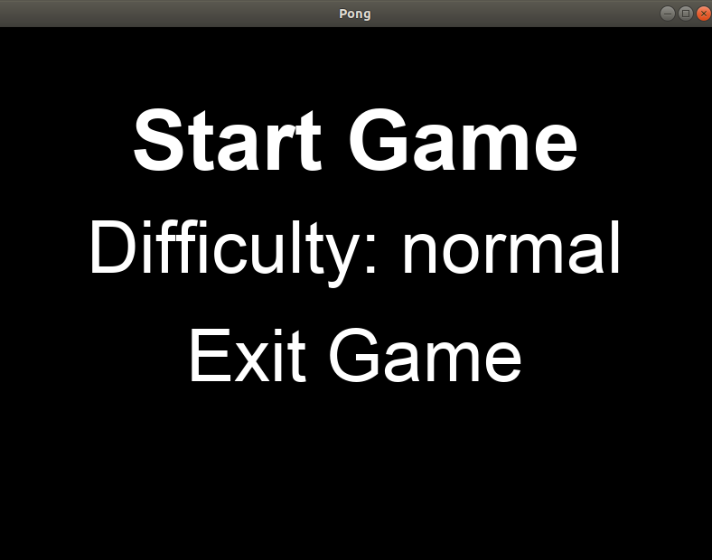
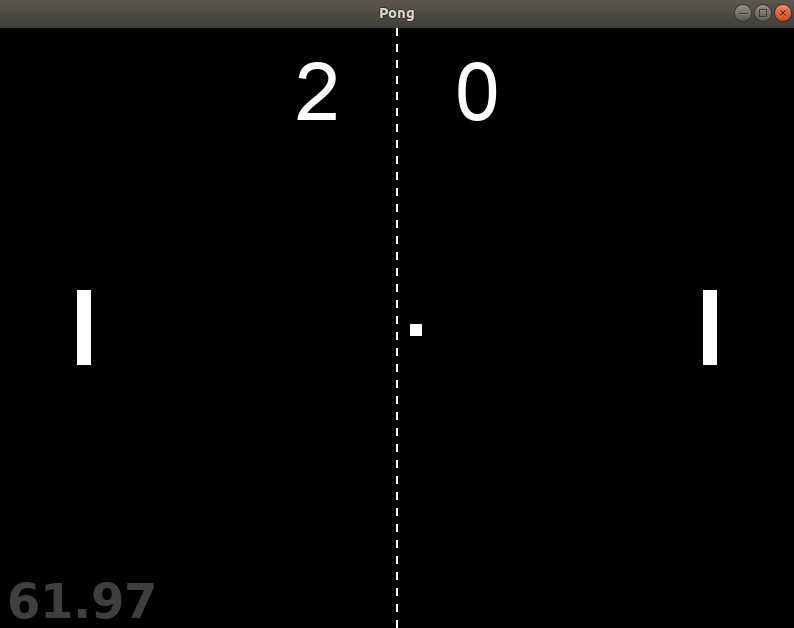

## PONG

Files:
* game.py - procedural version
* game_oop.py - object oriented version

---

Initial design ideas for this game are from [Trevor Appleton procedural pong][trevor-appleton]
and [noobtuts C++ pong][noobtuts-pong] tutorial.

Game design stages:

```text
Stage 1 - Create a blank window
Stage 2 - Draw the court, the paddles and the ball
Stage 3 - Move the ball around
Stage 4 - Check for a collision with all walls
Stage 5 - Move the players paddle
Stage 6 - Move the computers paddle with simple AI
Stage 7 - Add a scoring system
Stage 8 - Add sounds
Stage 9 - Resize window
Stage 10 - Add game menu
Stage 11 - Make game easier by adding a difficulty levels 
```





---

Features implemented:
- [x] movement control
- [x] collision detection
- [x] scoring
- [x] artificial intelligence
- [x] add sounds
- [x] game menu
- [x] resizing window (only in procedural version)
- [x] add handicap for player or ai difficulty levels
- [x] add new OOP version

---

Sounds are from [opengameart.org](https://opengameart.org/)

To make them work install AVBin from [AVBin-Page](http://avbin.github.io/AVbin/Download.html). 
Or turn them off inside the script.

[noobtuts-pong]: https://noobtuts.com/cpp/2d-pong-game
[trevor-appleton]: http://trevorappleton.blogspot.com/2014/04/writing-pong-using-python-and-pygame.html
